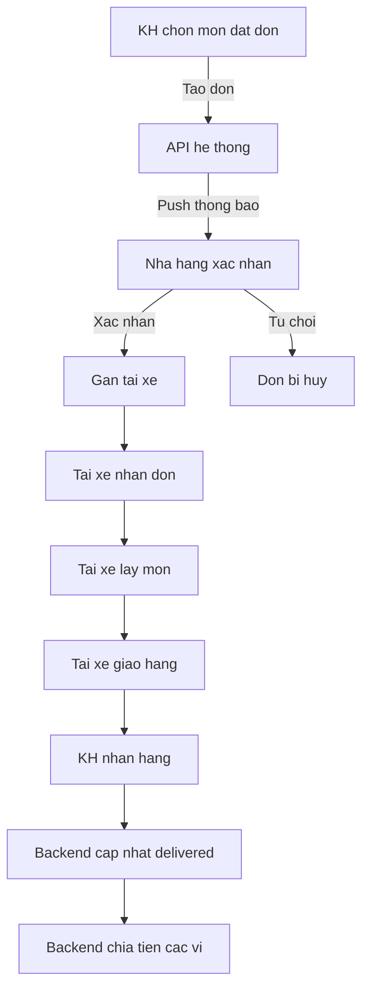
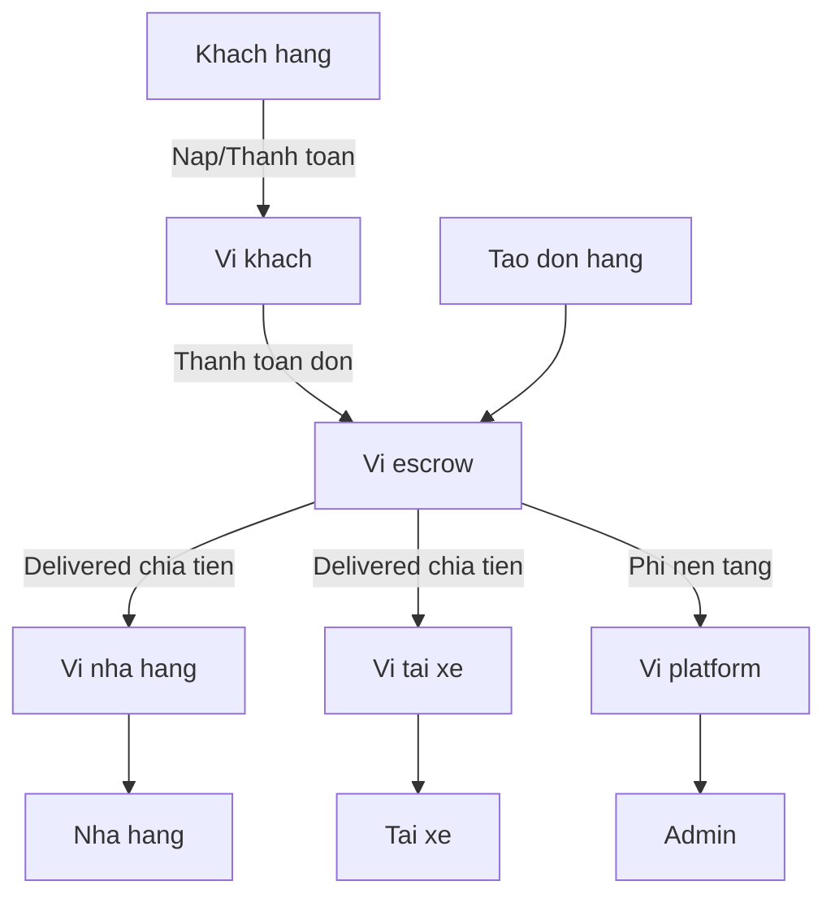

# LỜI NÓI ĐẦU / MỞ ĐẦU

Trong bối cảnh xã hội hiện đại, dịch vụ đặt và giao đồ ăn trực tuyến ngày càng trở thành một phần quen thuộc trong đời sống hàng ngày. Các nền tảng giao đồ ăn đã mở ra một kênh kết nối quan trọng giữa khách hàng, nhà hàng và tài xế, mang lại nhiều tiện lợi. Tuy nhiên, đằng sau sự tiện lợi đó, vẫn tồn tại không ít bất cập từ cả ba phía tham gia hệ thống.

- **Khách hàng** thường gặp phải tình trạng thời gian chờ lâu do đơn hàng bị ghép chung nhiều đơn khác, dẫn đến trải nghiệm không như kỳ vọng. Ngoài ra, chi phí phát sinh nhiều phụ phí chồng chéo, cùng với những khó khăn khi thiết lập vị trí giao hàng ở các khu vực hẻm sâu hoặc nơi Google Maps không hiển thị chính xác, khiến họ phải đặt vị trí tạm, dẫn đến sai sót trong giao nhận. Một số ứng dụng còn gặp vấn đề trong trải nghiệm người dùng như thao tác phức tạp, thông báo đơn hàng không ổn định.
- **Nhà hàng** chịu nhiều áp lực từ các nền tảng, khi bị trừ mức chiết khấu cao, thậm chí phải tham gia các chương trình khuyến mãi bắt buộc, gây khó khăn trong việc duy trì lợi nhuận. Bên cạnh đó, việc cập nhật thực đơn hoặc quản lý đơn hàng đôi khi chưa thuận tiện, dẫn đến sai sót và giảm hiệu quả vận hành.
- **Tài xế** là đối tượng trực tiếp chịu ảnh hưởng nặng nề khi thu nhập liên tục bị cắt giảm, trong khi khối lượng công việc ngày càng nhiều. Việc phải xử lý đồng thời nhiều đơn hàng, gặp khó khăn trong tối ưu lộ trình ghép đơn, hay đối diện với sự thiếu minh bạch trong hỗ trợ từ hệ thống khiến trải nghiệm công việc ngày càng áp lực. Ngoài ra, giao diện ứng dụng dành cho tài xế thường chưa được tối ưu, thao tác phức tạp, gây ảnh hưởng đến tốc độ xử lý đơn.

Xuất phát từ những bất cập thực tiễn này, kết hợp với trải nghiệm hơn hai năm trong vai trò tài xế giao đồ ăn, tôi lựa chọn thực hiện đề tài “EatNow – Hệ thống đặt đồ ăn nhanh”. Mục tiêu của đề tài là phát triển một hệ thống có khả năng:

- Giúp khách hàng đặt món nhanh chóng, theo dõi đơn hàng trực quan, giảm thiểu sai lệch vị trí.
- Hỗ trợ nhà hàng quản lý thực đơn, đơn hàng và doanh thu một cách minh bạch hơn.
- Cung cấp cho tài xế công cụ thao tác thuận tiện, cập nhật vị trí GPS theo thời gian thực, tối ưu lộ trình và giảm bớt gánh nặng công việc.
- Cho phép quản trị viên theo dõi, điều phối toàn hệ thống, cũng như điều chỉnh chính sách hợp lý.

Đề tài không chỉ là một nghiên cứu học thuật, mà còn mang tính ứng dụng cao, xuất phát từ chính những trải nghiệm thực tế và nhu cầu cấp thiết trong ngành dịch vụ giao đồ ăn. Tôi kỳ vọng hệ thống này có thể phần nào khắc phục các hạn chế hiện nay, đồng thời đem đến trải nghiệm công bằng và hiệu quả hơn cho cả khách hàng, nhà hàng và tài xế.

---

# Chương 1. TỔNG QUAN (CƠ SỞ LÝ THUYẾT)

## 1.1 Giới thiệu đề tài & Mục tiêu nghiên cứu

EatNow — Hệ thống đặt đồ ăn nhanh là một giải pháp prototype kết nối khách hàng, nhà hàng và tài xế theo quy trình đặt – xử lý – giao – nhận. Đề tài này nối các actor lại trong một hạ tầng hiện đại áp dụng realtime communication, hướng tới:

- Xây dựng hệ thống đặt đồ ăn với kiến trúc hiện đại, ưu tiên realtime và tối ưu quy trình xử lý đơn.
- Tối ưu hóa trải nghiệm người dùng qua giao diện đơn giản, trực quan, thao tác ngắn
- Nghiên cứu và giải quyết các vấn đề thực tiễn trong ngành giao đồ ăn dựa trên trải nghiệm nhiều năm làm tài xế của tác giả
- Ứng dụng các công nghệ web & mobile tiên tiến (NestJS, Next.js, Flutter, Socket.IO)
- Minh bạch hóa phương thức vận hành, tối ưu doanh thu tài xế & nhà hàng, giảm bất cập lộ trình và hỗ trợ hệ thống.

## 1.2. Bối cảnh thị trường và thực trạng

Ngành giao đồ ăn trực tuyến tại Việt Nam đang phát triển cực nhanh, quy mô nhiều tỷ USD (Statista 2024), chủ yếu bởi ShopeeFood và GrabFood (cùng chiếm >95% thị phần thành phố lớn). Mô hình kết hợp đối tác Nhà hàng – Tài xế – Khách hàng đã đem lại nhiều thành công như:

- Xây dựng được mạng lưới hợp tác rộng, kỹ thuật mạnh, xử lý được lượng lớn đơn hàng
- Đa dạng thanh toán, khuyến mãi phong phú
- Tích hợp AI tối ưu routing, giảm chi phí giao hàng
  Tuy nhiên, thực tiễn ghi nhận vẫn tồn tại nhiều bất cập:
- Khách hàng thường chờ lâu do ghép đơn, mất phí ngoài cao, vị trí giao hàng khó thiết lập chuẩn trong hẻm sâu hoặc do giới hạn Google Maps. Thao tác đặt hàng phức tạp, thông báo push đơn hàng mất ổn định.
- Nhà hàng bị trừ chiết khấu cao (tới 25-30%), lệ thuộc vào thuật toán nền tảng để được hiển thị, quản lý đơn/hàng hóa khó minh bạch, thiếu công cụ phân tích dữ liệu chuyên sâu.
- Tài xế chịu áp lực hoàn thành đơn nhanh nhưng nhiều lúc bị ghép đơn lệch lộ trình, thu nhập giảm (do thưởng/chi phí ngầm), khiếu nại khó, giao diện ứng dụng chưa tối ưu cho thao tác thực tế, nhiều thủ tục dài dòng.
- Hạn chế kỹ thuật: một số app thiếu realtime tracking, push notification không ổn định, UI còn rườm rà, hệ thống dễ lag crash khi cao điểm.

Đề tài EatNow được phát triển trên nền tảng lý thuyết và khảo sát thực tiễn, hướng tới vượt qua các bất cập nêu trên nhờ kiến trúc realtime, minh bạch và tối giản — đồng thời chuyển hóa bài học kinh nghiệm cá nhân thành giải pháp công nghệ cụ thể.

## 1.3 Cơ sở lý thuyết / công nghệ nền tảng

- **NestJS (Node.js Framework, TypeScript):**

  - Framework backend module hóa, vận hành trên Node.js sử dụng TypeScript giúp code an toàn, nâng cao chất lượng và khả năng mở rộng. Hỗ trợ Dependency Injection, Decorator, logic RESTful, tổ chức module hóa.
  - Là nền tảng vận hành toàn bộ API nghiệp vụ, xác thực nhiều vai trò, xử lý realtime/sockets cho hệ thống.
- **Next.js (React Framework):**

  - Framework frontend hiện đại trên nền React, nổi bật với Server-side rendering (SSR) để tăng SEO, optimize performance và trải nghiệm trình duyệt. Dễ quản lý layout, routing động.
  - Đảm nhiệm UI/UX, dashboard, logic client-side cho mọi user (khách, admin, nhà hàng, tài xế).
- **React Native (Expo):**

  - Bộ công cụ phát triển app mobile cross-platform bằng JavaScript với cùng triết lý React, cho phép dev và test nhanh (live reload), dễ dàng tích hợp backend thông qua HTTP hoặc Socket.IO.
  - Được chọn để phát triển app tài xế giao hàng (driver), đem lại trải nghiệm thực tế, xây dựng giao diện native đơn giản hóa thao tác, realtime nhận đơn và cập nhật.
- **Socket.IO (WebSocket Communication):**

  - Thư viện phổ biến cho kết nối two-way realtime dựa trên WebSocket, fallback tốt qua polling với quản lý room/event linh hoạt.
  - Áp dụng cho các luồng realtime như: thông báo đơn mới, cập nhật trạng thái đơn hàng, truyền thông tin vị trí giữa tài xế, nhà hàng và khách hàng.
- **MongoDB & Mongoose ODM (NoSQL Database):**

  - CSDL NoSQL dạng document giúp tổ chức dữ liệu linh hoạt, scale hiệu quả và thay đổi nhanh chóng nghiệp vụ. Mongoose giúp validate và query dữ liệu dễ dàng hơn.
  - Lưu trữ dữ liệu động: users, đơn hàng, transaction, logs, v.v.
- **Redis (In-memory Data Store):**

  - Storage tốc độ cao cho cache, session, queue, pub/sub sự kiện realtime. Hỗ trợ các primitive như GEO (vị trí tài xế), sorted set (queue assignment).
  - Tăng performance realtime và tối ưu xử lý, giảm tải truy vấn DB gốc.
- **JWT (JSON Web Token, RFC7519):**

  - Chuẩn xác thực không trạng thái với token mã hóa, truyền user/role claim an toàn; ứng dụng cho phân quyền giữa các actor.
  - Kết hợp cookie để tăng bảo mật (SameSite, HttpOnly) và dễ dàng xác thực ở cả FE/mobile.
- **React 18, Zustand, Context API:**

  - Giao diện component-based logic rõ ràng, Zustand/Context cho phép chia sẻ trạng thái user, socket, session login đồng bộ đa page.
  - Đảm bảo dashboard luôn realtime, thao tác mượt, dễ bảo trì mở rộng.
- **TailwindCSS / Material UI (MUI):**

  - Hệ thống style utility-first (Tailwind) cùng UI kit (MUI) giúp dựng giao diện nhanh, đồng nhất, responsive (mobile-first).
  - Có lợi cho teamwork FE nhiều page, tối ưu hóa tốc độ phát triển và trải nghiệm trên nhiều thiết bị.
- **MoMo Payment Gateway API:**

  - Cổng thanh toán tích hợp qua REST API, xác thực callback/chữ ký, kiểm soát idempotency giao dịch.
  - Hỗ trợ nghiệp vụ đặt hàng/trả phí thật sự, giúp kiểm nghiệm end-to-end workflow thực tế.
- **Google Maps Platform / OpenStreetMap / react-native-maps / Geolocator:**

  - Dịch vụ nền tảng bản đồ và định vị GPS; API geocoding, tìm kiếm, routing, vẽ tuyến di chuyển và reverse location.
  - Định vị tài xế, khách hàng, hiển thị lộ trình, xử lý bài toán giao hàng trong hẻm nhỏ.
- **Jest, Postman, Swagger, Github Actions (Testing/Tài liệu/CI-CD):**

  - Jest cho kiểm thử unit/backend tự động; Postman test thủ công endpoint, mô phỏng flow; Swagger sinh docs OpenAPI hỗ trợ đồng bộ hóa giữa các developer; Github Actions tự động kiểm thử, build, deploy.

---

# Chương 2 – PHÂN TÍCH & THIẾT KẾ HỆ THỐNG

### 2.1 KHẢO SÁT THỰC TẾ, ĐỐI TƯỢNG VÀ BÀI TOÁN

- **Diễn giải thực trạng:**Hệ thống giao đồ ăn hiện tồn tại các bất cập về trải nghiệm giao/nhận đơn, thu nhập tài xế, chiết khấu nhà hàng, vấn đề định vị, thiếu realtime, kiểm soát workflow và bảo mật.
- **Các đối tượng/tác nhân chính:**
  - **Khách hàng:** Đặt món, theo dõi trạng thái, lịch sử giao dịch, quản lý địa chỉ.
  - **Nhà hàng:** Quản lý menu, xác nhận và chuẩn bị đơn hàng, xem thống kê, nhận thông báo realtime.
  - **Tài xế:** Nhận/giao đơn, định vị GPS, cập nhật trạng thái đơn, tương tác trực tiếp với hệ thống nhận đơn thông minh.
  - **Admin:** Quản lý tổng thể users, hệ thống, nội dung, monitor dashboard, kiểm soát policy, quản lý danh mục.
  - **Ngoài ra:** Payment Gateway, Map API, Notification Service.

---

### 2.2 PHÂN TÍCH NGHIỆP VỤ & LUỒNG CHÍNH

#### 2.2.1 Luồng hoạt động tổng quát

- **Khách hàng:**Đăng nhập → duyệt nhà hàng/thực đơn → thêm món vào giỏ (theo từng nhà hàng) → chọn địa chỉ giao → tạo đơn → theo dõi realtime.
- **Nhà hàng:**Đăng nhập → xác nhận đơn mới (push realtime) → chuẩn bị → chuyển sang “ready/picked_up” khi tài xế nhận.
- **Tài xế:**Đăng nhập → nhận đơn gợi ý (theo điểm smart-assignment) → xác nhận nhận đơn → cập nhật trạng thái khi lấy hàng/xong đơn.
- **Admin:**
  Đăng nhập → quản lý users/menu/order → theo dõi Dashboard, danh mục, hệ thống.

#### 2.2.2 Sơ đồ tổng thể

- **Kiến trúc 3 lớp:** Frontend (web/mobile) – Backend (API, websocket) – Database/Service (MongoDB, Redis, MoMo, ...)
- **Module chính:** Auth, User, Order, Cart, Restaurant, Driver, Notification, Payment, Wallet

#### 2.2.3 Luồng đơn hàng chi tiết

1. Khách tạo đơn từ giỏ hàng của một nhà hàng → đơn ở trạng thái `pending`.
2. Nhà hàng xác nhận → chuyển sang `confirmed` → chuẩn bị và chuyển `preparing`.
3. Hệ thống gán tài xế phù hợp bằng smart assignment (Redis geo, thứ tự điểm).
4. Tài xế nhận đơn, cập nhật trạng thái theo luồng: `picked_up` → `delivered`.
5. Notification gửi realtime tới các bên liên quan.

---

### 2.3 THIẾT KẾ HỆ THỐNG VÀ MODULE

#### 2.3.1 Kiến trúc tổng thể

- **Backend:**
  - NestJS (RESTful, WebSocket, module hoá theo domain)
  - Mongoose ORM cho MongoDB, Redis dùng cache/geolocation/tracking
  - JWT + Cookie-based auth chia từng role, bảo mật hạng cao (HttpOnly, SameSite, CSRF)
  - Đảm bảo không vòng lặp logic giữa controller/service/model
- **Frontend:**
  - Next.js (App Router), React, Tailwind, MUI cho dashboard, phân quyền UI.
  - Phân rõ layout: admin/sidebar, customer/bottom-nav, restaurant/driver/tab control.
  - Tận dụng Context API và hook tự phát triển cho auth, API, socket.
- **Mobile app:**
  - Flutter skeleton, đang chờ phát triển thêm (tập trung demo driver).

#### 2.3.2 Phân rã các module backend (chuẩn hóa code base)

- **/auth:** Đăng nhập bằng role, đăng ký cho customer. Xác thực bằng cookie riêng cho từng loại tài khoản, hỗ trợ multi-login.
- **/order:** Quản lý lifecycle đơn hàng, trạng thái, tracking thời gian thực, driver assignment.
- **/cart:** Quản lý giỏ hàng theo cặp userId + restaurantId, không tồn tại trạng thái, tự động xóa sau khi checkout.
- **/restaurant:** CRUD menu/nhà hàng, nhận đơn realtime.
- **/driver:** Giao diện API cho driver nhận, trả, xác nhận hoàn thành đơn.
- **/notification:** Push socket.io và lưu DB trạng thái đã đọc/chưa đọc.
- **/user/customer/admin:** Quản lý thông tin, auth, tìm kiếm, quản lý profile/user CRUD.
- **/wallet/payment:** Xử lý ví, transaction, tích hợp MoMo (REST); support callback/verify.

#### 2.3.3 Database & Dataflow

- **MongoDB:**
  - User, Order, Cart, Restaurant, Driver, Notification, Payment, Wallet.
  - Schema hóa với Mongoose, ràng buộc rõ ràng, tối ưu index.
- **Redis:**
  - GEO cho vị trí tài xế, sorted set cho hàng đợi đơn, pub/sub notification push.
  - Atomic Lua script bảo vệ concurrency/assignment.
- **Mô hình dữ liệu thực tế:**
  - `Order`: Phân role rõ (userId, restaurantId, driverId), trạng thái riêng biệt, mapping chuẩn.
  - `Cart`: Không lưu trạng thái, chỉ tồn tại trong từng transaction.

#### 2.3.4 Thiết kế bảo mật, hiệu năng, mở rộng

- **Bảo mật:**
  - Validate input (DTO + class-validator)
  - Tách rõ cookie/role, HttpOnly + SameSite
  - Không lưu token chung, không dùng localStorage
  - API lỗi trả thông tin chi tiết, log stack trace
- **Hiệu năng & mở rộng:**
  - Hầu hết thao tác DB đều qua service layer, không truy vấn lặp
  - Caching hợp lý ở các điểm trọng yếu (đơn mới, thông báo)
  - Sẵn sàng scale module hóa, dễ tách microservice hoá nếu cần

---

### 2.4 TÓM TẮT & ĐÁNH GIÁ

- EatNow ưu tiên đồng bộ giữa documentation – code – nghiệp vụ thực tế
- Kết nối realtime, workflow tối giản, bảo mật tối đa
- Mọi module độc lập, có thể scale riêng, không bị ràng buộc vòng lặp
- Kiến trúc thuận tiện bảo trì, kiểm thử, học tập và mở rộng.

### 2.5 ĐIỂM NỔI BẬT, TÍNH NĂNG KHÁC BIỆT & CẬP NHẬT MỚI


**Xác thực đa vai trò hiện đại:**

- Cookie-based auth tách biệt hoàn toàn cho từng vai trò (`customer/restaurant/driver/admin`).
- Cho phép đăng nhập nhiều vai trò cùng lúc trên một máy.
- Middleware, AuthContext, Flow đăng nhập/đăng xuất kiểm soát đồng bộ mọi trạng thái, bảo mật cao (HttpOnly, SameSite, Secure).
- Không còn dùng access_token chung; kiểm soát phân quyền triệt để, rất khó nhầm lẫn/đánh cắp session.


**Hệ thống ví (Wallet) phân quyền – thanh toán real MoMo:**

- Mỗi actor (khách/nhà hàng/tài xế/admin) có ví riêng, transaction log chi tiết.
- Tiền thanh toán vào escrow platform, chia tự động khi đơn hoàn thành, ẩn platform fee với user/restaurant—admin duy nhất thấy chi tiết phí.
- Nạp/rút tiền, callback và thanh toán đều kiểm soát idempotency.


**Schema đơn hàng nâng cấp & Migration hỗ trợ mở rộng:**

- Bổ sung chi tiết items/options, trạng thái tracking lịch sử, feedback, voucher, tip, fee, analytics...
- Có thể chạy song song schema cũ/mới, migration script an toàn không làm mất dữ liệu.
- Frontend/backend đồng bộ interface, API RESTful chuẩn cho thao tác đơn hàng hiện đại.


**Notification real-time hóa và module hóa toàn diện:**

- Notification qua cả REST và Socket.IO, lưu vào collection riêng, phòng notification theo đối tượng, đồng bộ đa tab.
- Tích hợp sẵn trong mọi tác vụ order/payment, đóng/mở thông báo, push trạng thái mới tức thì.


* **Frontend & Backend đồng bộ, module hóa rõ cho từng domain:**

- Code chia module cực rõ: từng domain 1 thư mục service/controller/module riêng, đọc dễ, test độc lập, bảo trì tiện lợi.
- FE chia route/layout riêng cho từng role, tận dụng tối đa Context/Hook/data/state/socket.
- Dễ mở rộng microservice hóa cho từng mảng (nếu cần).


**Setup, hướng dẫn, triển khai & bảo mật production:**

- Tài liệu, env, guide, deployment note đầy đủ.
- Khuyến nghị rõ từng bước chứng thực khi chạy thật: cookie SameSite, Secure, hide fee, kiểm soát callback MoMo, health check, structured logging, lỗi luôn log stack trace.


**Nhấn mạnh ưu điểm đặc biệt:**

- Chạy đa vai trò không cần clear cookies, multi-login các actor không lỗi context.
- Bảo mật nâng cao (so với nhiều bản open source cùng loại): cookie-based theo vai trò + CSRF + không lưu token FE + phân quyền bằng middleware.
- Quản trị phí, flow tiền minh bạch, business logic platform fee ẩn linh hoạt.
- Notification, report, REST, realtime, và guide chuẩn open source, dễ dùng – dễ học – dễ mở rộng.


---

# Chương 3 – THỰC NGHIỆM VÀ KẾT QUẢ ĐẠT ĐƯỢC

3.1 Cài đặt hệ thống & kiểm thử

- Hướng dẫn build/run: clone repo, cài node, cài nhanh backend/frontend/mobile
- Mô tả cấu trúc code các module chính

#### - **Triển khai hệ thống trên môi trường Production (Cloud)**

- **Frontend (Vercel):**
  - Deploy thành công trên nền tảng Vercel (serverless, tối ưu static file/SSR Next.js).
  - Link production: https://eat-now.vercel.app/
  - FE lấy API qua biến `NEXT_PUBLIC_API_URL=https://eatnow-wf9h.onrender.com/api/v1`.
  - Quản lý env riêng biệt cho build/dev/prod, tối ưu domain, bảo mật cookie prod (SameSite=None; Secure).
- **Backend (Render):**
  - Deploy trên Render, cấu hình auto build, start đúng `/backend`.
  - Link production: https://eatnow-wf9h.onrender.com
  - Tích hợp MongoDB Atlas, Redis Cloud bản prod, auto migration schema.
  - Swagger public để test nhanh production API: https://eatnow-wf9h.onrender.com/api
  - Health check, log structured trên BE để monitoring.
- **CI/CD:**
  - Repo kết nối trực tiếp source với Vercel & Render, mỗi lần cập nhật code sẽ auto redeploy toàn bộ (không cần thao tác thủ công).
  - Tách riêng env cho local và production nhằm tránh rò rỉ thông tin nhạy cảm và bảo mật hệ thống.
- **Quy trình kiểm thử trên cloud:**
  - Test trực tiếp đăng nhập, order, payment, notification; simulate nhiều vai trò trên môi trường thực tế.
  - Kiểm chứng được trải nghiệm người dùng ngoài môi trường local, đáp ứng login multi-role, push notification, flow ví MoMo, rollback trạng thái...
  - Truy cập production an toàn, mọi API vận hành ổn định, client–server tách độc lập, bảo mật tốt.
- **Ý nghĩa:**
  - Dự án không chỉ dừng ở demo local mà đã đưa vào vận hành, thử nghiệm thực tế với người dùng thật trên môi trường cloud production.
  - Tăng tính ứng dụng thực tế, minh chứng chất lượng kiến trúc – giải pháp hệ thống đã sẵn sàng scale và sản xuất thật nếu mở rộng.

## 3.2 Kết quả đạt được

### 3.2.1 Tổng quan kết quả

- Ảnh chụp màn hình từng role (customer/restaurant/driver/admin)
- Mô tả demo đặt món, nhận đơn realtime, tracking GPS, cập nhật trạng thái
- Bảng tính năng đã đạt: notification, order flow, wallet, dashboard

### 3.2.2 Bảng tổng hợp chức năng đã hoàn thiện

| Nhóm chức năng        | Customer        | Restaurant  | Driver          | Admin       |
| ------------------------ | --------------- | ----------- | --------------- | ----------- |
| Đăng nhập, xác thực | ✅              | ✅          | ✅              | ✅          |
| Quản lý đơn hàng    | ✅              | ✅          | ✅              | ✅          |
| Quản lý giỏ/ví       | ✅              | ✅          | ✅              | -           |
| Notification realtime    | ✅              | ✅          | ✅              | ✅          |
| Dashboard/thống kê     | ⬜ (basic)      | ✅          | ✅              | ✅          |
| Quản lý feedback       | ⬜ (schema)     | ⬜ (schema) | ⬜ (schema)     | ⬜ (schema) |
| Mobile native            | ⚠️ (skeleton) | -           | ⚠️ (skeleton) | -           |

➡️ *Chú thích: ✅ Có đủ use/test thực tế; ⬜ Chỉ mới có schema/logic nền tảng; ⚠️ Đang phát triển/app demo.*

### So do Use Case tong quat he thong EatNow

```mermaid
graph TD
    Customer --> UC_Login
    Customer --> UC_Browse
    Customer --> UC_Cart
    Customer --> UC_Track
    Customer --> UC_Payment
    Customer --> UC_Noti

    Restaurant --> UR_NewOrder
    Restaurant --> UR_UpdateOrder
    Restaurant --> UR_Menu
    Restaurant --> UR_Revenue
    Restaurant --> UR_Noti

    Driver --> UD_Login
    Driver --> UD_Accept
    Driver --> UD_Status
    Driver --> UD_Noti
    Driver --> UD_Wallet

    Admin --> UA_Users
    Admin --> UA_RestaurantsDrivers
    Admin --> UA_Dashboard
    Admin --> UA_Content

    UC_Login[Dang ky / Dang nhap]
    UC_Browse[Duyet nha hang / menu]
    UC_Cart[Dat mon / Gio hang]
    UC_Track[Theo doi trang thai don]
    UC_Payment[Thanh toan / Nap tien]
    UC_Noti[Nhan thong bao realtime]

    UR_NewOrder[Nhan / Xac nhan don moi]
    UR_UpdateOrder[Quan ly don / Trang thai]
    UR_Menu[Quan ly menu]
    UR_Revenue[Xem / Thanh toan doanh thu]
    UR_Noti[Nhan thong bao]

    UD_Login[Dang nhap / Xac nhan]
    UD_Accept[Nhan / Giao don]
    UD_Status[Cap nhat trang thai giao hang]
    UD_Noti[Nhan thong bao don moi]
    UD_Wallet[Xem vi / Thu nhap]

    UA_Users[Quan ly users]
    UA_RestaurantsDrivers[Quan ly nha hang / tai xe]
    UA_Dashboard[Theo doi dashboard]
    UA_Content[Quan ly noi dung]
```

*Chu thich: So do the hien actors va cac chuc nang chinh; dung ASCII de tuong thich Mermaid 8.8.0.*

---

### So do activity luong dat / giao don

*Chu thich: Luong tu dat → xac nhan → giao → hoan thanh → chia thu nhap; dung ASCII.*

---

### So do ERD cac thuc the chinh EatNow
```mermaid
erDiagram
    USER ||--|| CUSTOMER
    USER ||--|| RESTAURANT
    USER ||--|| DRIVER
    USER ||--|| ADMIN

    CUSTOMER ||--o{ ORDER
    CUSTOMER ||--o{ CART
    CART ||--o{ CARTITEM

    RESTAURANT ||--o{ MENU
    RESTAURANT ||--o{ ORDER
    ORDER }o--|| RESTAURANT

    ORDER }o--|| DRIVER
    DRIVER ||--o{ ORDER

    CUSTOMER ||--o{ WALLET
    DRIVER ||--o{ WALLET
    RESTAURANT ||--o{ WALLET
    ADMIN ||--o{ WALLET
    WALLET ||--o{ TRANSACTION

    ORDER ||--|{ ORDERITEM
    ORDER ||--|{ NOTIFICATION
```
*Chu thich: CUSTOMER dat order/cart; RESTAURANT quan ly menu/nhan order; DRIVER giao order; Wallet gan voi tung actor; ASCII de tuong thich.*

---

### So do activity: Luong tien & thanh toan

*Chu thich: Tien vao escrow khi tao don, chi khi delivered moi chia: nha hang + tai xe + platform; dung ASCII.*

---

### 3.2.3 Chức năng chưa hoàn thiện hoặc còn giới hạn MVP

- App mobile: chỉ có bộ khung Flutter, chưa đủ tính năng vận hành thật.
- Payment prod: mới tích hợp MoMo sandbox, chưa prod hoặc đa payment gateway.
- Feedback – review tài xế/order: schema đã có, chưa UI/front/flow thực.
- Quản lý kho/inventory restaurant: còn sơ khởi schema, chưa dev UI/logic chính thức.
- Phản hồi CSKH, live chat, khiếu nại: chưa phát triển.
- Push notification mobile (native): mới có cho web/socket.
- Loyalty, voucher, analytics chuyên sâu, AI suggest, AI tối ưu route: chưa phát triển.
- Monitoring, alert, microservice hóa: hệ thống còn monorepo, chưa chia service độc lập hoặc triển khai alert prod.

---

## 3.3 Đánh giá – ưu nhược điểm

- So với app thương mại lớn: EatNow đáp ứng nhanh, phân tách module tốt, dễ thử nghiệm/mở rộng/code rõ ràng — hạn chế về quy mô production, payment/AI/analytics chưa tới mức enterprise.

## 3.4 Khó khăn – Bài học kinh nghiệm thực tiễn

- Gặp nhiều thách thức về bảo mật cookie cross-domain, CORS, chính sách SameSite khi triển khai cloud production multi frontend/backend; đã tối ưu bằng config chặt domain/path & dùng SameSite=None, https strict.
- Khi test real notification/websocket trên Render/Vercel phải kiểm thử đa trình duyệt thực tế, debug kỹ nhiều session đồng thời, phát hiện bug nhanh nhờ log structured.
- Việc seed/migrate schema data order phức tạp, đòi hỏi phải viết script và test rollback nhiều lần mới đạt được dữ liệu nhất quán.
- CI/CD cloud giúp demo dễ dàng, nhưng mỗi lần refactor chính sách env/production cần kiểm soát chặt biến bảo mật, phân quyền rõ nguồn kết nối.
- Quá trình tối ưu UX thực tế: Phải luôn kiểm tra responsive mọi màn hình, không chỉ dựa UI mẫu mà cần user thật demo, phát sinh nhiều bug nhỏ trên các browser/device khác nhau.

## 3.5 Ý kiến đánh giá từ user thử nghiệm

- Người dùng/Friends thử nghiệm online cơ bản đều đánh giá "giao diện clear, thao tác đặt món nhanh, notification thật sự realtime", tuy nhiên một số nghiệp vụ nâng cao (ví dụ: phân phối tiền live, mobile native, analytics) cần hoàn thiện thêm để dùng quy mô lớn.

---

EatNow là nền tảng ứng dụng chuyển hóa ý tưởng thực tiễn ngành delivery thành giải pháp phần mềm hiện đại – là nền móng expand ra đa dạng mảng Delivery/Logistics/AI nếu tiếp tục đầu tư mở rộng trong tương lai.

// Placeholder: bổ sung hình demo/usecase, activity, bảng so sánh, performance chart nếu cần.

---

# NHẬN XÉT VÀ KẾT LUẬN

EatNow là sản phẩm phản ánh sâu sát các vấn đề thực tiễn ngành giao đồ ăn Việt Nam (quy trình lộn xộn, chi phí cao, trải nghiệm khách/tài xế chưa đồng bộ, thông báo không realtime, kiểm soát phí/thu nhập kém minh bạch…). Nền tảng kết tinh kinh nghiệm thực tế từ quan điểm tài xế lẫn nghiên cứu ngành, chuyển hóa khối kỹ năng phân tích hệ thống lớn thành một giải pháp phần mềm ứng dụng thực tiễn – có kiến trúc hiện đại, backend/frontend module hóa tối đa, bảo mật tốt, minh bạch code.

Hệ thống đã thử nghiệm, vận hành production, đáp ứng mạch nghiệp vụ trọng tâm: đặt hàng, xác thực, chia sẻ trạng thái – notification realtime, ví điện tử đa vai trò, chia doanh thu tự động, dashboard thống kê, CI/CD cloud, hướng mở rộng mạnh. Tuy nhiên, nhiều mục tiêu mở rộng nâng cao vẫn còn dang dở do đặc thù sản phẩm cá nhân/thử nghiệm MVP.

EatNow vẫn còn rất nhiều tiềm năng scale lớn – microservices hóa, tích hợp AI, payment đa dạng, bảo mật production nâng cao, tối ưu chi phí vận hành, đầy đủ trải nghiệm mobile/app bản địa hóa…

---

# HƯỚNG PHÁT TRIỂN

- Tích hợp các cổng thanh toán Việt Nam/Quốc tế: VNPAY, ZaloPay, MoMo production/commercial.
- Thêm các module ML/AI: gợi ý món, định tuyến delivery tối ưu, auto gợi ý suất ăn hợp lịch/sức khỏe.
- AI camera và nhận diện hình ảnh cho quản lý nhà hàng, tracking tài xế/khách thực tế.
- Chia nhỏ thành hệ microservice độc lập, tối ưu scale và quản trị vận hành lớn.
- Phát triển logistics, quản lý tồn kho, tự động hóa quy trình kho/vận chuyển/analytics chuyên sâu cho nhà hàng lớn/kênh B2B.
- Ra mắt app di động native (React Native/Flutter) cho full actor: customer, driver, restaurant.
- Tiếp tục cải tiến UI/UX, bổ sung feedback, CSKH in-app, loyalty/voucher, analytics sâu…

---

# Phụ lục 5: TÀI LIỆU THAM KHẢO

Tiếng Việt

[1] VnExpress (2024), “Không còn lãi khi bán đồ ăn online”, VnExpress, Hà Nội.
[2] MoMo (2024), Tài liệu tích hợp cổng thanh toán MoMo, MoMo, TP. Hồ Chí Minh.
[3] EatNow Project (2024), Báo cáo kỹ thuật và triển khai EatNow, Nội bộ, TP. Hồ Chí Minh.

Tiếng Anh

[4] Statista (2024), Vietnam Online Food Delivery Market, Statista, Hamburg.
[5] Q&Me (2024), Food Delivery Report Vietnam, Q&Me, Ho Chi Minh City.
[6] NestJS (2024), NestJS Documentation, NestJS, Online.
[7] Vercel (2024), Next.js Documentation, Vercel, San Francisco.
[8] MongoDB Inc. (2024), MongoDB Manual, MongoDB, New York.
[9] Redis Ltd. (2024), Redis Documentation, Redis, Tel Aviv.
[10] Google LLC (2024), Flutter Documentation, Google, Mountain View.
[11] Socket.IO (2024), Socket.IO Documentation, Socket.IO, Online.

---

*Placeholder cho bảng hình ảnh, sơ đồ Use Case, Activity, ERD nếu bổ sung sau.*
